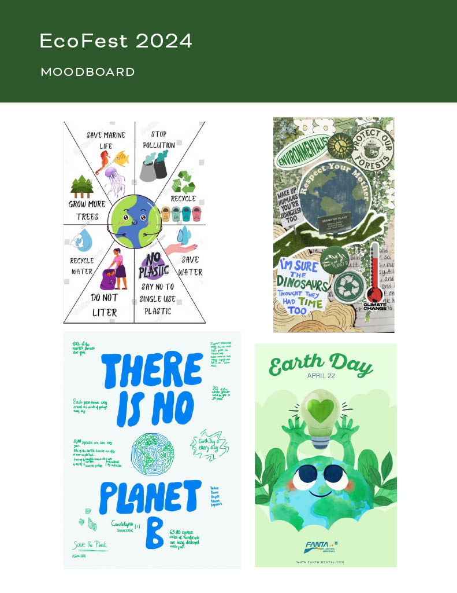

# Social Justice Festival Website

by Phoebe Julao.

# project overview
EcoFest is a three-day festival designed for environmentally-conscious individuals, primarily college students, and community members interested in affordable sustainability and eco-friendly practices.

The festival aims to raise awareness about the affects of climate change and promote simple, everyday eco-friendly living practices. Proceeds from the event will support The Nature Conservancy, a California based non-profit organization dedicated to promoting carbon neutrality and sustainability.

It's crucial to support environmental sustainability to reduce our carbon footprint, combat climate change, and preserve our planet for future generations. I believe as young adults entering the adult world and being independent in the world is overwhelming and expensive, even so our daily practices within ours means such as simply as using our screens and devices, can affect our planets health over time.

EcoFest will take place from May 24th to May 27th at Golden Gate Park, featuring a series of events aimed at promoting sustainable living and environmental conservation. The festival will kick off with a "Green Future Seminar," followed by a "Zero-Waste Market" and a "Green Tech Expo" on the second day. The festival will conclude with a "Carbon-Neutral Concert" and a "Community Clean-Up" event.
# technical overview

The site will be constructed via Visual Studio Code 2

Fonts

Bicyclette designed by Nikola Kostic and Zoran Kostic from Kostic type Foundry
https://fonts.adobe.com/fonts/bicyclette

Concept and Wireframe in Figma

Brand Guide created in InDesign 

# acknowledgement

Thank you to the Nature Conservancy for collaborating with me to create this festival and website. Click the link below for information about the organization:
https://www.nature.org/en-us/
